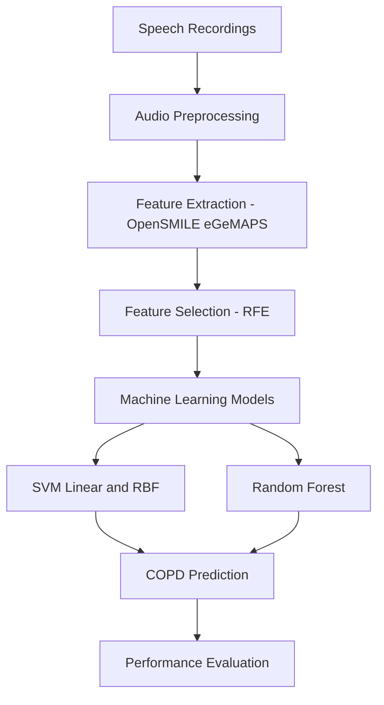

# Speech-Based-COPD-Detection

## Project Pipeline

Machine learning approach for non-invasive COPD detection using sustained vowel speech recordings.
This project presents a non-invasive machine learning framework for Chronic Obstructive Pulmonary Disease (COPD) detection using sustained vowel speech recordings.

Features
Audio preprocessing
eGeMAPS feature extraction using OpenSMILE
Feature selection using Recursive Feature Elimination (RFE)
SVM and Random Forest classification
Stratified K-Fold and Leave-One-Speaker-Out (LOSO) evaluation
ROC-AUC based performance analysis

Tools
Python
OpenSMILE
Librosa
Scikit-learn
NumPy
Pandas

Models
Support Vector Machine (Linear & RBF)
Random Forest
Evaluation
Accuracy
ROC-AUC
Precision
Recall
F1-score
